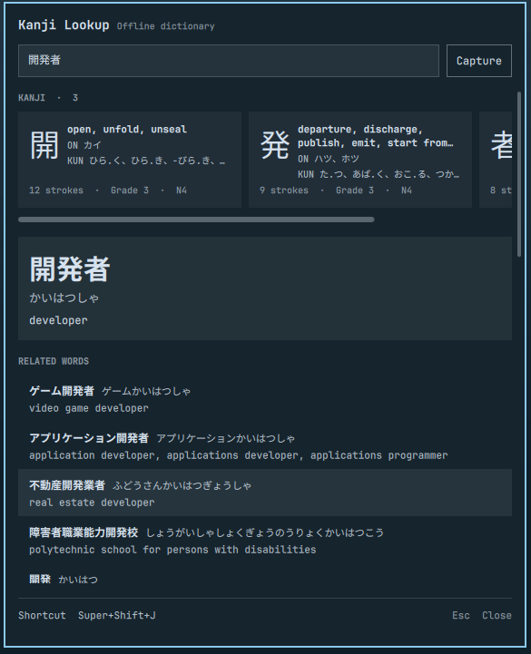

# Kanji Lookup

An offline Japanese dictionary for the Omarchy bar, built from JMdict and
KANJIDIC2. Type a word, look up selected text, or capture kanji straight off
the screen with OCR.

The goal is a quick answer: look a word up and get back to what you were
reading. This is not a study tool and will not become one; it does not teach
Japanese, and features like Anki integration are out of scope.

The panel shows the kanji that make up the word as small cards, the focused
word with its reading and full definition, and related entries underneath.
Clicking a related entry focuses it and puts the previous word first in the
list. Tab moves through cards and entries, Enter or Space opens one, Escape
closes the panel. Kanji cards show meanings, on/kun readings, and estimated
JLPT levels from community study lists (see resources/README.md).

## Install

    omarchy plugin add https://github.com/Expri-commits/kanji-lookup
    omarchy plugin enable io.github.expri-commits.kanji-lookup
    omarchy bar move io.github.expri-commits.kanji-lookup --section right

Then build the dictionary once:

    ./scripts/build-db.py

Optional, for the OCR capture button:

    omarchy pkg add tesseract-data-jpn tesseract-data-jpn_vert

## First run and the dictionaries

The repository does not ship the dictionary data. The build script downloads
JMdict and KANJIDIC2 from the canonical jmdict-simplified releases, caches
the zip files in `~/.local/share/kanji-lookup/src/`, and compiles them into
one sqlite database (about 19 MB) at `~/.local/share/kanji-lookup/jmdict.db`.
That download and build is why the first run takes a few minutes; running the
script again skips the downloads and finishes in under a second. After the
build, lookups work fully offline and take about 30 ms. Until the database
exists, the panel says so and points to the build script.

## Use

Click the 辞 button in the bar. The label is the kanji 辞, read ji, as in
辞書 (dictionary). You can bind a key as well; Omarchy keeps keybinds in
your own config, so a plugin cannot install one for you. A keybind can call
`smartTrigger`, which looks up the freshest
selection when one changed within the last 5 seconds and otherwise opens the
panel and starts a region capture. Super+Shift+J is the suggested bind; any
key works:

    o.bind("SUPER + SHIFT + J", "Kanji lookup", [[
      P="$(timeout 0.5s wl-paste --type text --primary 2>/dev/null)"; \
      C="$(timeout 0.5s wl-paste --type text 2>/dev/null)"; \
      omarchy-shell io.github.expri-commits.kanji-lookup smartTrigger "$P" "$C"
    ]])

The exact description "Kanji lookup" lets the panel detect the binding, so
the footer shows your actual shortcut. Apps that never publish a selection
still work after Ctrl+C. A display-only `shortcutHint` override on the bar
entry in `~/.config/omarchy/shell.json` covers wrappers the detector cannot
read.

The Capture button (撮) starts a region capture: drag a box over Japanese
text and the result lands in the search field; a longer sentence lists the
dictionary words found in it. Uncertain readings are retried on a cleaned-up,
enlarged copy of the selection, which fixes outlined text on bright
backgrounds. Recognition is still imperfect on stylized fonts or clipped
characters.

The CLI uses the same lookup as the panel:

    python3 scripts/lookup-json.py 敬語

## Uninstall

    omarchy plugin remove io.github.expri-commits.kanji-lookup --yes

Optionally delete the data directory `~/.local/share/kanji-lookup/`.

## Development

Install a local checkout:

    rsync -a --exclude .git --exclude '*.db' ~/Documents/Projects/kanji-lookup/ \
      ~/.config/omarchy/plugins/io.github.expri-commits.kanji-lookup/
    omarchy-shell shell rescanPlugins

Run the tests:

    python3 -m unittest discover -s tests -v

Image tests use the local Tesseract data and ImageMagick and skip when those
are missing.

## License

Plugin code is MIT; see LICENSE. JMdict and KANJIDIC2 are © EDRDG under
CC BY-SA 4.0; see LICENSE-EDRDG (https://www.edrdg.org/edrdg/licence.html).
JLPT level estimates come from Jonathan Waller's study pages; see
resources/README.md.
